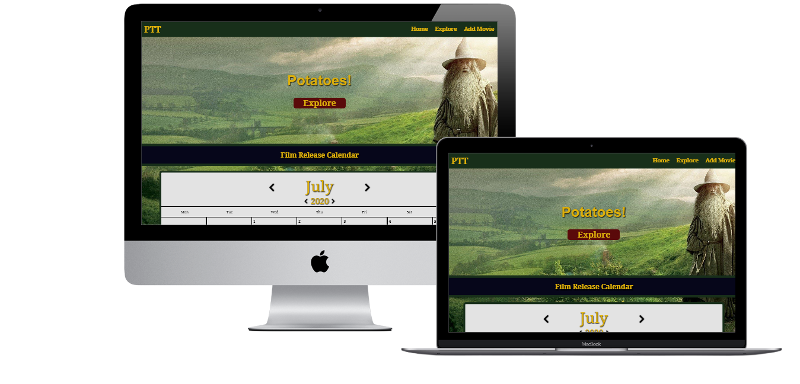

# **Po - Tay - Toes!**

## **Milestone project 3: Data Centric Development - Code Institute**

A site to record and see all upcoming movies that you are excited to see



## Demo 

A live Demo version can be found [here](https://po-tay-toes.herokuapp.com/)


## Table of Contents:

1. [UX](#UX)
    1. [Goals](#Goals)
    2. [User Stories](#User-stories)
    3. [Strategy](#Strategy)
    4. [Scope](#Scope)
    4. [Structure](#Structure)
    4. [Skeleton](#Skeleton)
    4. [Surface](#Surface)
2. [Technologies](#Technologies)
    1. [Tools](#Tools)
    2. [Libraries and frameworks](#Libraries-and-frameworks)
    3. [Languages](#Languages)
3. [Features](#Features)
    1. [Features left to implement](#Features-left-to-implement) 
4. [Testing](#Testing)
5. [Deployment](#Deployment)
    1. [Instructions](#Instructions)
    2. [Deployment to Heroku](#Deployment-to-Heroku)
6. [Credits](#Credits)
    1. [Content](#Content)
    2. [Media](#Media)
    3. [Acknowledgment](#Acknowledgment)

## UX

### **Goals:**
* To give users a way to track film releases 

* To create a more minimalistic website in comparison to film review and film information websites

* To create ease of access to film basic film information 

### **User Stories**

> Lists of film releases contain all films being released which includes a lot of films I'm not interested in

> I love going to the cinema but I have such a busy working life it's hard to remember when all the films I want to
see are coming out.

> I really like seeing who has directed and produced a film as well as the actors, I will often go to see a film just
because it's directed by someone I like.

> I'm really into indie and low-budget films, these can be hard to keep track of through the mountain of advertisement 
that bigger films get.

Users seemed keen for a better way to view upcoming films. A full list of films didn't seem to appeal to anyone as they
always contain lots of films that weren't interesting to them. Particularly this seemed true to people who are very interested
in films, the big releases are well advertised and it is hard to forget their release dates when you see them on five billboards per day.

### **Strategy**

The focus of this project changed quite early on. Originally it was going to be a film review site but due to the restriction on
login authentication for this project it was decided under advice with my mentor that we should should focus on something that required
less personal user input than a review. This would mean that the site could feature CRUD functionality without creating frustration 
should another user delete a review that a user had worked hard on. The calendar idea seemed appealing to users as it allows for 
the user to control which upcoming films are displayed and remove other information that is not of interest to them. 

### **Scope**

This site is aimed at film enthusiasts and appealing to a community who are interested in finding out about lesser known films.
The calendar is the focus of the website and other pages are additions to enable that functionality or for extra information.

### **Structure**

The site is made up of five pages. The landing page contains the calendar. From the calendar the user can open 
a film modal to give extra info about a specific film. This modal is also accesible from the explore page. The explore page 
is for users wanting to search for specific films that they may not know the release date for or simply prefer this version of navigation.
There is a page to display films for days where there are more than two films released that day. In this case the film posters would
distort the calendar cells so another page is necessary to make these films accesible without changing the format of the calendar.

### **Skeleton**

Using figma the following wireframes were made:

[Desktop](https://github.com/OGMyst/milestone-Project-three/blob/master/static/Mockups/desktop.pdf)

[Phone](https://github.com/OGMyst/milestone-Project-three/blob/master/static/Mockups/phone.pdf)

These mockups reflect the original design for the project for a film review site. I kept the themes and general layout as
they both fitted with the new focus but I also hope to add film reviews to the site later and I would like to use the same
layout.

### **Surface**

The color themes were based off the well known books and film series The Lord of the rings. The colors chosen were green, gold, blue, and maroon.
The link to the lord of the rings comes from the title of the website which is a reference to a popular film review site rotten tomatoes but also 
to a line from the lord of the rings films. The colors are taken primarily from the clothes worn by Theoden and his kingdom. The green is also the
color of the cloaks worn by the fellowship of the ring. The colors blend well together but are distinctive enough so that everything is clear. 

## **Technologies**

### Tools

  - [Heroku](https://www.heroku.com/) For hosting the application and deployment.
  - [Github](https://github.com/) To share and store code remotely.
  - [Git](https://git-scm.com/) To manage version control.
  - [MongoDB](https://www.mongodb.com/), The Database for the website
  - [Canva](https://www.canva.com/) was used to design images on the web.
  - [Figma](https://www.figma.com) For the wireframes design.

### Libraries and frameworks

  - [Flask](https://flask.palletsprojects.com/en/1.1.x/) python micro web framework used to create this project.
  - [MaterializeCSS](https://materializecss.com/) a CSS library used to develop this site.
  - [FontAwesome](https://fontawesome.com/) For social media icons
  - [Google fonts](https://fonts.google.com/) to bring custom font styling.

### Languages

  - This project uses HTML, CSS, Javascript and Python programming languages.

## Features

- This website features a calendar which shows upcoming films added by users. The images grow on hover, shows a modal to display
more information about the film. In case of more than two films being released on the same date the user can click on the the 
date and a page with all films for that date. 

- The menu collapses into a sidebar on mobile 

- The explore page for films features pagination and a searchbar

- The Navbar takes the user to all pages but not the individual release date pages

- The site has CRUD functionality for information on the films

### Features Left to Impliment

- Login authentication. This will allow users to have their own personal calendar as well as a community one.

- Film reviews. With login authentication users could create reviews which only they could edit and delete.

- Add a limit to the pagination. Currently the numbers being displayed does not have a limit so eventually 
a limit of how many page links in the pagination need to be limited and range introduced

## Testing

- All internal links work. 

- The site is responsive over different screen sizes with custom layouts where appropriate. The site has been tested on 
Mozilla Firefox, Google Chrome and safari and works as intended.The site was tested on an android phone, Iphone, 
tablet, Ipad, laptop, and desktop. All site functions work as intended.

- The console displays no errors during site testing

- This site has been tested by family and friends and no errors have been found. 

- The javascript has undergone unit testing and passes all tests

- The site was was not made with TDD as I was still figuring out concepts of
how best to implement my ideas. The tests were added after completing the code.

- Not all functions were tested. I left those functions that only contained simple commands,
such as "classList.add", untested. I felt they were too basic to test as
it is very clear to see if they are working as intended or not.   


The following tests have been used to ensure proper site functionality:
* GTmetrix: To test on website loading times
* W3C HTML Validator: This validator checks the markup validity of Web documents in HTML.
* W3C CSS Validator: This validator checks the markup validity of Web documents in CSS.
* JSHint: A static code analysis tool for JavaScript.

### **Bugs**

#### **The alt fault**

In cases where a film poster wasn't avaiable the alt text was not being restricted to the width of 53px. On
days with two films present, the second poster was being pushed onto a new line and distorting the calendar layout.
I tried fixing this by nesting the image inside a div with display flex but this created two divs in the case of 
two films and the second would get pushed onto a new row. I could have fixed this by changing the logic two put
all films inside their own singular div however I decided it was easier to change the image display property to 
inline-block. This fixed the issue. 

#### **Modal**

I initially designed for the modal to be only accesible from the films page. As the site developed it became clear
that the modal should also be accesible from the calendar as well. This took a lot changes of code since the 
modal framework was in the HTML file and the javascript was tailor made to how that framework which wouldn't work in
the index.html file. I changed it so that the javascript file constructed the entire modal, incidentally making the 
method of how the data provided by the database was collected, and could be attached to any file which had the modal-background
id. 

#### **Paginate**

The arrows for the pagination was going up by two on every click and there was an issue that I couldn't disable 
the onclick function and fix the issue with the pages going up two. This issue took so long in trying to resolve
that I decided to remove the arrows and have the numbers for pagination as I didn't feel the arrows were necessary.
The functionality changed for pagination so instead of sorting all films only the films to be displayed are being 
called.  


#### **Growing but not covering**

The film posters being displayed were given a class to make them grow on hover. However the dates from other cells 
were still displaying even though the date in the cell of the poster was not. This was fixed by giving the image a 
z-index = 1. 

#### **Iphone and Ipad Display**

On Iphones and Ipads the bacgkround attachment fixed property does not seem to take effect. The screen size is well within the 
limit of the media query and on android phones the image adjusts as intended. This means that there is a white 
background for part of the page. I was unable to fix this bug as it seems to be an issue with iphone and ipad, on 
macbook the image displays as intended across different browsers and I couldn't work out what the issue was. 

## Deployment

### Instructions
  1. Download a copy of this repository from the link https://github.com/OGMyst/milestone-Project-three as a download zip file. Or at your terminal do the following git command:

      ```
      $ git clone https://github.com/OGMyst/milestone-Project-three
      ```
  2. If you downloaded the project as a zip file, unzip it and add it in your directory.
  3. To not run in some unexpected behaviours during development, a virtual environment is advised to be used before the project be installed in your machine. So create a virtual environment with the command:

      ```
     $ python -m venv venv
      ```
 4. After you already created the virtual environment folder you need to activate it:

      ```
      $ source venv/bin/activate
      ```
    5. Install requirements.txt file.

      ```
      $ pip install -r requirements.txt
      ```
    6. Create an `env.py` file to store environment variable keys.

     ```
     import os

    os.environ["SECRET_KEY"] = ('<Your secret key>')
    os.environ["MONGO_URI"] = ('<Your MongoDb URI>')
    os.environ["MONGO_DBNAME"] = ('<Your MongoDb database name>'))

    7. Add a git ignore file to not submit sensitive data to Github repository.

     ```
     $ touch .gitignore
     ```
     - Then add the `env.py` to the `.gitignore` file.

     ```
     $ git update-index --assume-unchanged env.py
     ```
     - Depending where the the `env.py` is locate the path will change.

### Deployment to Heroku

To make the deployment of this application to `Heroku` you will need to do the following steps.

  1. Signup for [Heroku](https://signup.heroku.com/)
  2. Install [Heroku-CLI](https://devcenter.heroku.com/articles/heroku-cli)
  3. After installing `Heroku toolbelt` add the following code into your termial and login into your account you already create.
     ```
     $ heroku login
      Enter your Heroku credentials.
      Email: your@email.com
      Password (typing will be hidden):
      Authentication successful.
     ```
  4. Save all the requirements into the `requirements.txt` as mentioned before with the command:
     ```
     $ pip freeze > requirements.txt
     ```
  5. Create a file named `Procfile` and add the following config.
     ```
     web: python app.py
     ```
 6. After all the setup is done `git add .`, `git commit` and `git push` your application to a repository you created on Github.
 7. In your `Heroku`account click new and create new app.
 9. Select your region and create a name for your project.
10. In your `Heroku` settings click `reveal config vars`.
11. Add the following config variables:

| KEY            | VALUE         |
|----------------|---------------|
| Port | `<5000>`  |
| IP | `<0.0.0.0>`  |
| MONGO_URI| `<MONGO_URI>`  |

12.  After adding the config into your dashboard add the following commands.
  - `$ heroku login`
  - `heroku git:remote -a test-app-to-deploy`
  - `$ git push heroku master`

14. On your `Heroku` dashboard click on `open app` button and check if the application is running correctly.

## **Credits**

### **Content**

All content on this site was written by me.

### **Media**

All images were taken from [commons.wikimedia.org](commons.wikimedia.org)

## **Acknowledgements**

Code for building the calendar was taken from [here](https://github.com/niinpatel/calendarHTML-Javascript)

Inspiration for making the modal came from [here](https://www.youtube.com/watch?v=ptI8g-05VM0)

Code to make the posters grow on hover came from [here](https://travis.media/how-to-make-an-item-grow-on-hover-with-css/)